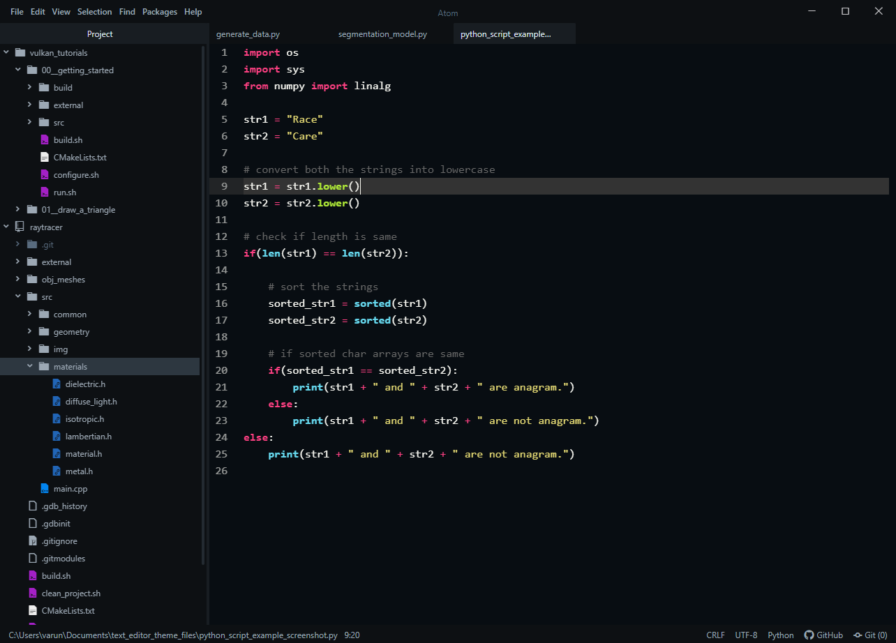

# neon-monocyanide theme for atom text editor

I couldn't find a theme that I liked on the atom package manager so I ported my favorite color scheme from sublime text. This port comes from Agila-Neon-Monocyanide theme. The syntax theme works very well with the Dash UI theme and the title-bar-replacer package - I think this makes atom my new favorite editor. If you find this, I hope you enjoy it.

I don't plan on making any updates or maintaining this, so feel free to fork, make your own changes, and publish your own package without citing me (If you do use this, maybe cite the original creator, this is his repo: https://github.com/arvi/Agila-Theme).

Packages used in screen shot:
- Dash UI theme
- title-bar-replacer

<!-- (https://f.cloud.github.com/assets/69169/2289498/4c3cb0ec-a009-11e3-8dbd-077ee11741e5.gif) -->
